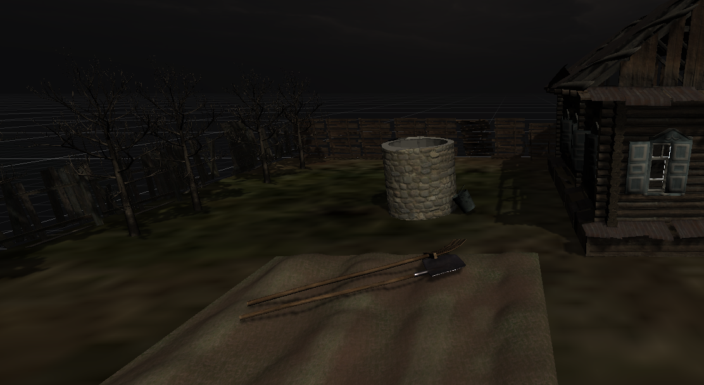
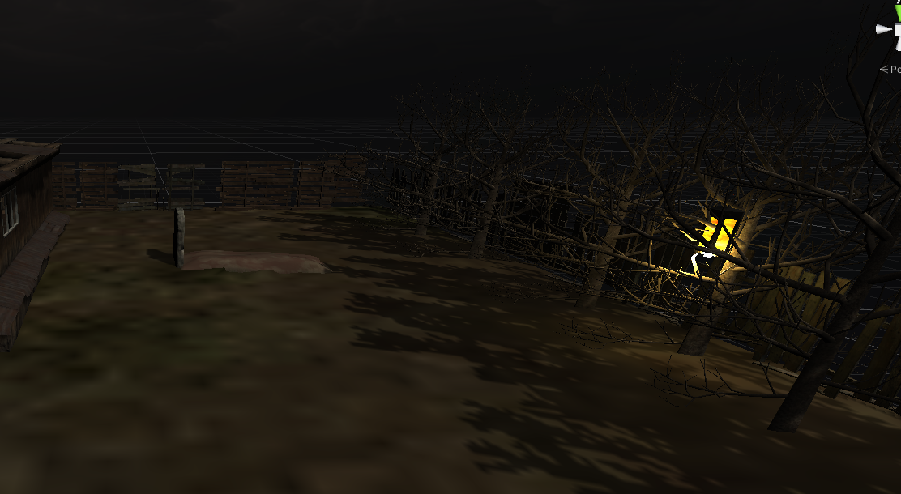
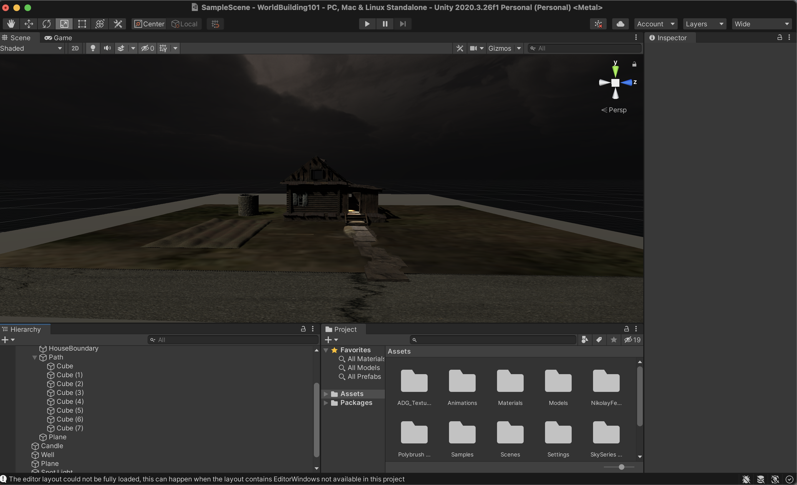
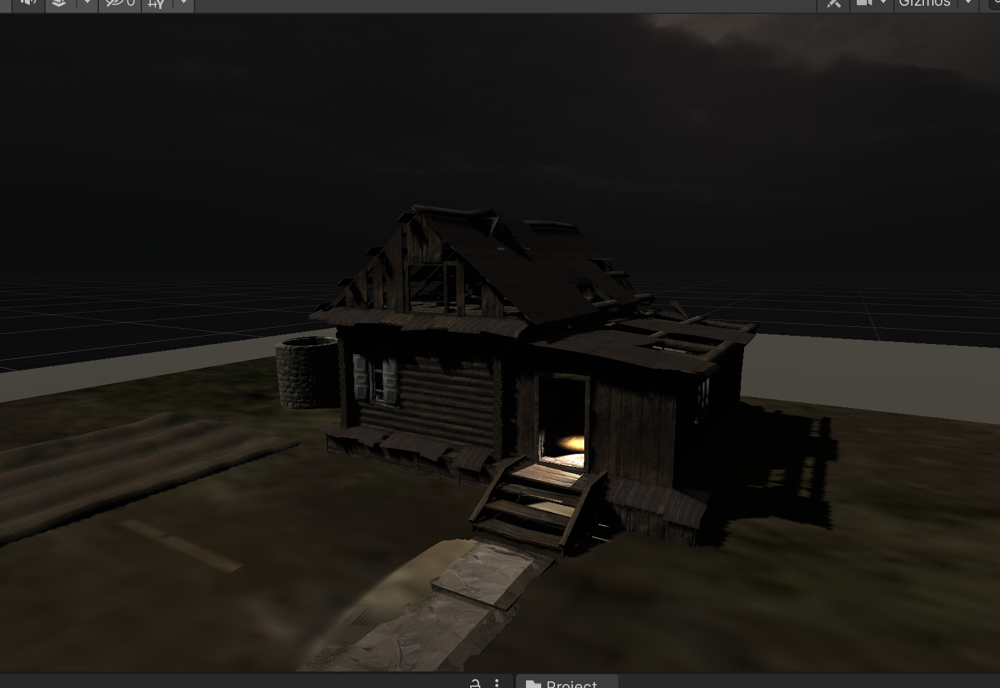
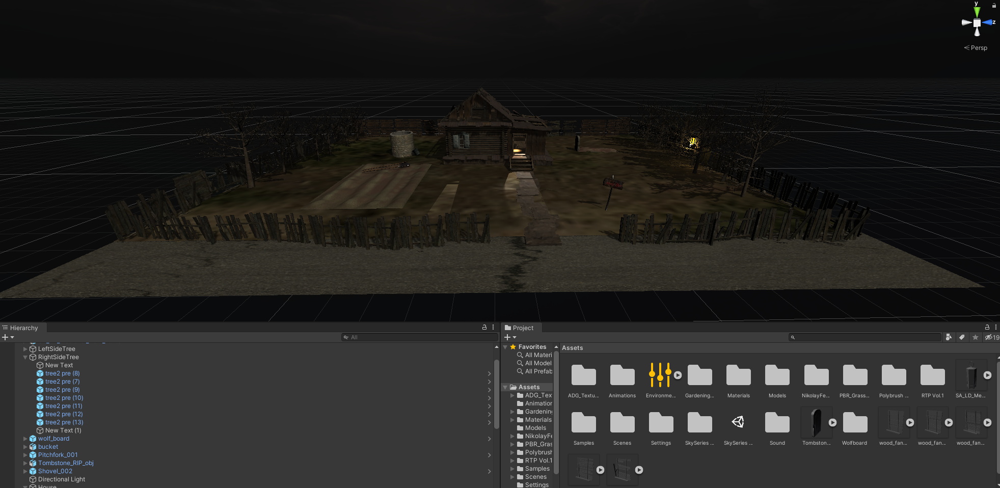
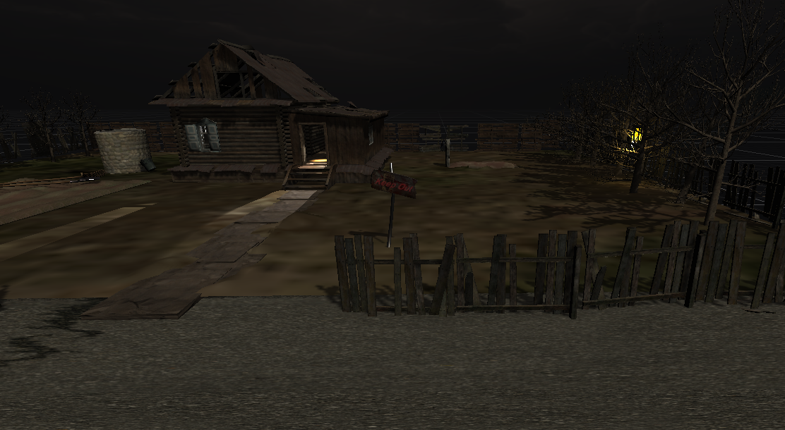

# Keep Out

Dare to go inside??

Slight inspiration from the animated movie monster house and stranger things

## Plot 

Mr. and Mrs. Nebbercracker were fed up with the civilization and made a house far from others. No one saw them- they never left the house- they had their small garden where they produced their food and got water from the well beside the house. No one knew what they looked like or what they did. One day there was a grave dug outside the house, it was speculated that Mrs. Nebbercracker had passed away. But no one went to the house to give their sympathies, because the Nebbercrackers did not want anyone even remotely close to their house. No one knows if Mr. Nebbercracker still lives.

One Halloween, you got keen to explore the house. But none of your friends are up for the plan. So you go alone near the house, however, you still do not have the guts to go inside and explore. You look around the house.
 

## Unity World

[Link to Video Walk-through](https://www.youtube.com/watch?v=fHfmW6DFMa0)

I added a few details like gardening tools and bucket to enforce the elements of the scene.

## Process

I started off by creating the storyboard for the experience. After browsing for inspirations online, I then downloaded the assets of the old house and tree. After that, I tried building my own assets using polybrush and polybuilder. Then I added light, animations and sound bringing the environment to life.

Progess before submitting the progress report:

Final project:

## Challanges 

One of the challanges that I encountered was finding the right assets. It was difficult to find the right asset that would go along with the environment. To solve that, I started building my own assets. I found the materials and textures from polyhaven and made the assets using Polybuilder.

Another difficulty I had was figuring our Polybuilder. 

## Reflection and Next Steps

I feel like there are few changes that would make the project even more immersive to the users. So as a future prospect I would make the environment more immersive and interactive for the user. I would look at what sound or visual effects can be added. Also whether the scene evokes the feeling I am going for? 

 
